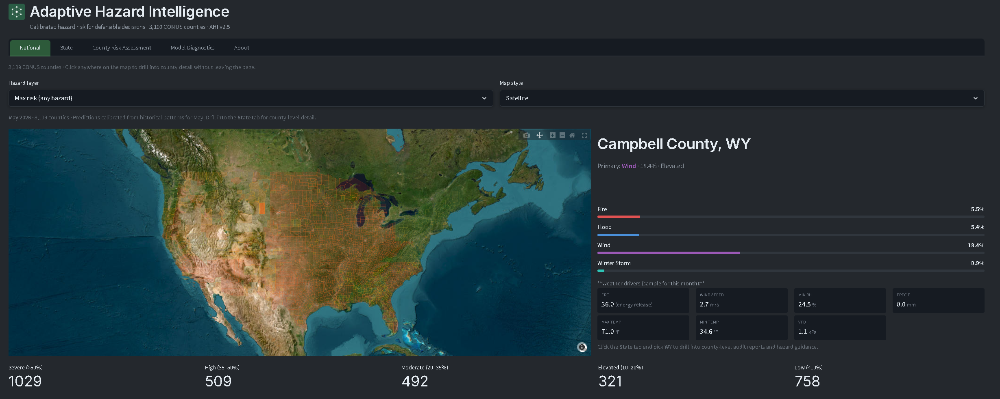

# Adaptive Hazard Intelligence (AHI)

**Resilience Analytics Lab, LLC**

---

## Overview

AHI is a calibrated, multi-hazard risk prediction system for the contiguous United States. It produces daily county-level probabilities for four natural hazards — wildfire, flood, wind, and winter storm — using a stacked dual-mesh deep learning architecture trained on 25 years of weather, satellite, and hazard event data across 3,109 counties.

The system is designed for emergency management decision-making at the county and regional level, providing calibrated risk tiers, audit-ready outputs, and structured decision support. Probabilities are temperature-scaled and seasonally adjusted so they mean what they say — not just relative rankings.

**Key properties:**
- Calibrated probabilities (not just rankings) via per-state temperature scaling + seasonal bias + base rate ceiling
- 61-feature input vector spanning weather, reanalysis, vegetation, terrain, flood zones, wildland-urban interface, satellite fire detections, streamflow, and severe wind reports
- 9 regional models serving 48 states + DC, each fine-tuned to local climate patterns
- FIRMS/SPC-validated labels: satellite fire detections and severe wind reports filter training labels to remove noise (85% false fire and 88% false wind labels removed)
- Runs on CPU via ONNX Runtime — no GPU required, fits within a 4 GB instance
- Live at [ahi.run](https://ahi.run)

---

## Architecture

AHI uses a **stacked dual-mesh** design (~1.55M parameters):

- **Temporal mesh** (3 layers, heat-kernel attention) — captures per-county weather dynamics with a locality-biased attention mechanism where nearby timesteps attend strongly and distant ones decay exponentially
- **Spatial mesh** (2 layers, standard softmax attention) — captures cross-county correlations using full attention to preserve long-range spatial coherence
- **Gated coupling** — learned scalar gate (~0.08) blends temporal and spatial signals, allowing the model to control how much spatial context enters the prediction
- **Per-hazard LoRA adapters** — low-rank specialization per hazard type without overwriting shared representations
- **Regional prediction heads** — 9 climate-region-specific output MLPs, fine-tuned after national backbone training

Calibration is applied post-inference: `sigmoid((logit + bias) / T + seasonal_bias)`, clamped to historical base rate ceilings.

The architecture is grounded in the heat kernel attention mechanism, where attention weights follow the heat equation solution rather than softmax normalization. This provides provable sparsity, compositional depth scaling, and a natural inductive bias for sequential data.

---

## Data Sources

| Source | Features | Coverage |
|---|---|---|
| NOAA GridMET | Temperature, humidity, wind, precipitation, ERC, VPD, fire weather | Daily, 2000-2025 |
| ECMWF ERA5 | Integrated vapor transport, total column water vapor, surface pressure, wind gusts, 2m temperature | Daily, 2000-2025 |
| NASA MODIS (Terra/Aqua) | NDVI, EVI, vegetation anomalies | Monthly, 2000-2025 |
| NASA FIRMS | Satellite fire detections — trailing 3-day and 7-day fire count, FRP (lagged features + label validation) | Daily, 2000-2025 |
| USGS NWIS | Daily streamflow discharge — trailing 3-day mean, delta, max (lagged features) | Daily, 2000-2025 |
| NOAA SPC | Severe wind reports — trailing 3-day severe days, max wind speed (lagged features + label validation) | Daily, 2000-2025 |
| FEMA NFHL | Special flood hazard areas, V-zones, X-zones | Static |
| SILVIS WUI | Wildland-urban interface fractions, vegetation cover, housing density | Static |
| NOAA Storm Events | Flood, wind, winter storm, tornado records | 2000-2025 |
| WFIGS | Historical wildfire locations and perimeters (10+ acre threshold) | All CONUS states |
| FEMA Disaster Declarations | County-level disaster records | 2000-2025 |
| USGS Earthquake Catalog | Seismic events (model trained but hidden from UI) | 2000-2025 |

---

## Repository Contents

This repository contains the deployed dashboard and inference pipeline. The model architecture, training pipeline, and training data preparation are maintained as proprietary assets.

| Path | Description |
|---|---|
| `app.py` | Streamlit dashboard application |
| `inference_onnx.py` | ONNX inference engine with per-state calibration pipeline |
| `state_context.py` | Per-state configuration loader |
| `models/<region>/model.onnx` | 9 regional ONNX models (~6 MB each) |
| `states/<XX>/` | Per-state calibration, inference data, GeoJSON, and config |
| `states/registry.yaml` | State deployment status and region mapping |
| `data/` | National precomputed prediction CSVs |
| `scripts/` | Utility scripts (national precompute, state onboarding) |

### Regional Model Coverage

| Region | States |
|---|---|
| great_lakes | IL, IN, KY, MI, OH, TN, WV |
| mid_atlantic | DC, DE, MD, NJ, NY, PA, VA |
| mountain_west | AZ, CO, ID, MT, NM, NV, UT, WY |
| new_england | CT, MA, ME, NH, RI, VT |
| northern_plains | IA, MN, MO, ND, SD, WI |
| pacific | CA |
| pnw | OR, WA |
| southeast_gulf | AL, AR, FL, GA, LA, MS, NC, SC |
| southern_plains | KS, NE, OK, TX |

---

## Tech Stack

- Python 3.11
- Streamlit — dashboard framework
- ONNX Runtime — model inference (CPU-only, no GPU required)
- Plotly — interactive mapping and visualization
- Pandas / NumPy — data processing
- Deployed on Render

---

## Research

AHI's architecture is grounded in published research on attention mechanisms and topological computation by Joshua D. Curry, available on SSRN:

- [Diffusion Attention: Replacing Softmax with Heat Kernel Dynamics](https://papers.ssrn.com/sol3/papers.cfm?abstract_id=5953096)
- [Heat Kernel Attention: Provable Sparsity via Diffusion Dynamics](https://papers.ssrn.com/sol3/papers.cfm?abstract_id=5959898)
- [Simplicial Computation: Topology as a Control Variable](https://papers.ssrn.com/sol3/papers.cfm?abstract_id=6037977)

---

## License

MIT License. See `LICENSE` for details.

The model architecture, training pipeline, and trained weights are proprietary assets of Resilience Analytics Lab, LLC and are not included in this repository.
